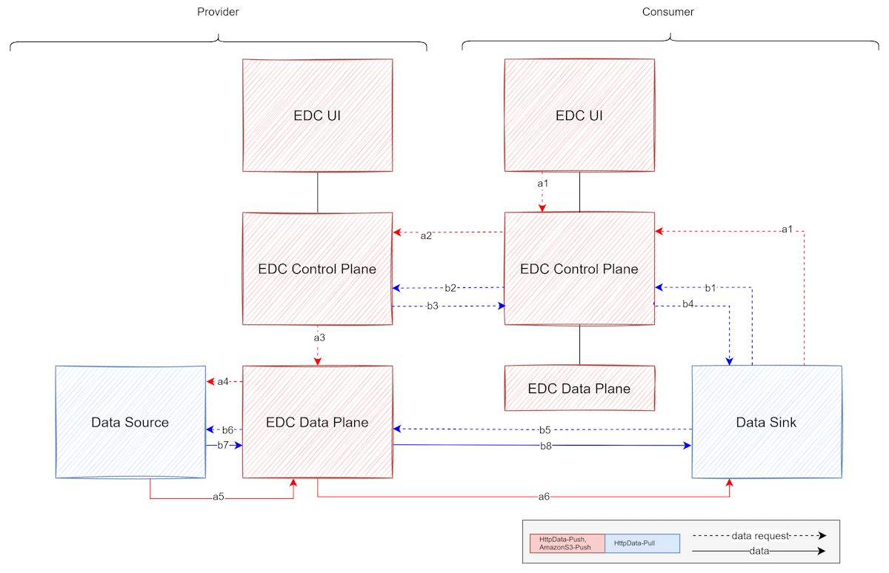

# Supported Transfer Types

The Connector supports various transfer types to enable secure and efficient data exchange. Below is an overview of the currently supported transfer types and their detailed workflows.

The transfer types **HttpData-Pull** and **AmazonS3-Push** are currently available only in our hosted Enterprise Edition.

## **1. HttpData-Push**

The `HttpData-Push` transfer type involves the provider fetching the data from its internal data source and pushing it to the consumer's desired data sink. This mode ensures the consumer receives the data without directly accessing the provider’s source system.

**Workflow**
1. **Initiation**:
   - The consumer triggers the transfer request, either through the EDC-UI or via API calls from a backend application. This backend can also act as the data sink (`a1`).
   - The consumer's control plane sends a transfer request to the provider's control plane (`a2`), including the consumer's sink URL and access credentials.

2. **Validation**:
   - The provider control plane verifies the context, ensuring the consumer is authorized to request the data.

3. **Data Fetching and Transfer**:
   - The provider's data plane retrieves the data from the defined source (e.g., a REST endpoint) based on the asset's data address (`a4`).
   - The fetched data is cached temporarily (`a5`) and then pushed to the consumer's data sink (`a6`).

## **2. HTTPData-Pull**

In the `HttpData-Pull` transfer type, the consumer actively retrieves data directly from the provider's endpoint using the details provided in an **Endpoint Data Reference (EDR)**.

**Workflow**
1. **Contract Negotiation**:
   - The consumer and provider agree on a contract agreement.

2. **EDR Issuance**:
   - The provider issues an EDR containing the endpoint URL, access credentials, and other metadata.

3. **Data Retrieval**:
   - The consumer uses the EDR to fetch the data directly from the provider’s endpoint via a `GET` or similar HTTP method and the details from the EDR.

## **3. AmazonS3-Push**

The `AmazonS3-Push` transfer type allows the provider to upload data directly to an Amazon S3 bucket managed by the consumer.

**Workflow**
1. **Initiation**:
   - The consumer initiates the transfer request via the EDC-UI or API.
   - The consumer provides the S3 bucket details (e.g., bucket name, region) and credentials, such as an AWS access key or a pre-signed URL.

2. **Validation**:
   - The provider validates the transfer request and ensures the consumer is authorized to receive the data.

3. **Data Upload**:
   - The provider's data plane uploads the data to the specified S3 bucket using the provided credentials.

## **Comparison of Transfer Types**

| Transfer Type      | Consumer Role                     | Provider Role                     | Mode                     | Example Use Cases                  |
|---------------------|-----------------------------------|------------------------------------|--------------------------|------------------------------------|
| **HttpData-Push**   | Provides data sink; initiates request | Fetches data and pushes to sink  | Asynchronous            | Batch file transfer, REST updates |
| **HttpData-Pull**   | Fetches data directly using EDR   | Issues EDR and hosts endpoint      | Consumer-driven          | On-demand API access              |
| **AmazonS3-Push**   | Provides S3 bucket details and credentials | Uploads data to consumer's S3 bucket | Asynchronous            | Large-scale data transfers |

The choice of transfer type depends on factors like real-time requirements, control over data flow, and system architecture.
